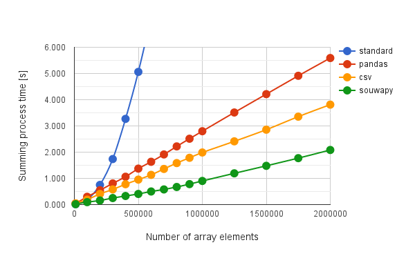

# souwapy

This is a Python's library for summing array elements with high speed by new algorithm. The speed is faster than csv and panbdas module of python and v8 engine of node.js. The souwapy module is 2.3 and 3.1 times faster than csv and pandas module, respectively.

## Description

SOUWA means summing in Japanese.

"souwapy" can sum string elements in an array with the high speed. The speed of souwapy with new algorithm is more than 1 digit faster than that of the standard algorithm. You can see the detailed theory of this library at [here](https://tanaikech.github.io/2016/10/13/improved-algorithms-for-summation-of-array-elements/). If you are interested in this, I'm glad. And if the theory had already been reported elsewhere, please let me know. I would like to study it.

## Requirement

- This library was confirmed the operation at python 2.7 and 3.5.

## Usage

```
$ pip install souwapy
```

Also you can download this from [GitHub](https://github.com/tanaikech/souwapy).

You can use this by following script.

```
from souwapy import SOUWA

s = SOUWA.sou()
result = s.getcsvdata(array, ",", "\n")
```

"array" is the array that you want to sum all elements. Arrays are 1, 2 dimensions and more dimensions.  e.g. Array = [a, b, c,,,,,] or Array = [[a, b, c], [d, e, f, g],,,,,]. Delimiter is ',' and ':' and etc. End code is '\n' and '\r\n' and etc.

You can try this library using sample script in directly of "tests".

## Theory of new algorithm

"souwapy" is a library for summing array elements with high speed using new algorithm. This algorithm had been made for Google Apps Script (GAS). It was found that the algorithm is also useful for python by measuring the speed. So this was made.

The algorithm is much faster speed than that of the standard algorithm using "+" operator as shown in following figure.


You can see the difference from above figure. Red and blue lines show the standard and new algorithm, respectively. When the number of elements increases, the summing process time increases. The behavior of the increase is different between standard and new algorithm. At the standard one, the process time increases proportionally to square of the number of elements. On the other hand, at new one, the process time increases lineally to the number of elements. This difference leads to the difference of process time.

In order to show clearly the difference, the ratio of difference (new algorithm / standard algorithm) is shown as following figure.


This figure shows the ratio of process time. This ratio also shows the difference of speed. At 1,000,000 elements, the speed of new algorithm is about 10 times faster than that of standard one. By the way, at GAS, the ratio of speed became about 380 times for 1,000,000 elements.

Following figure shows the process time vs. the number of array elements, when the array is outputted to a csv file. Blue, red, orange and green show the standard algorithm, pandas module, csv module and souwapy module, respectively.



The speed of each module is much faster than that of standard algorithm. In the speed of each module, csv module is 1.4 times faster than pandas module. The souwapy module is 2.3 and 3.1 times faster than csv and pandas module, respectively. It is found that the speed for translating from the array data to the csv file is souwapy module is the fastest in csv and pandas module.

You can see the detailed theory of this algorithm at following reports.

- [Improved Algorithms for Summation of Array Elements](https://tanaikech.github.io/2016/10/13/improved-algorithms-for-summation-of-array-elements/)

- [Effects on Optimized Codes of Pyramid Method](https://tanaikech.github.io/2016/10/13/effects-on-optimized-codes-of-pyramid-method/)

## Licence

[MIT](LICENCE)

## Author

[TANAIKE](https://github.com/tanaikech)

If you have some questions, feel free to tell me.


